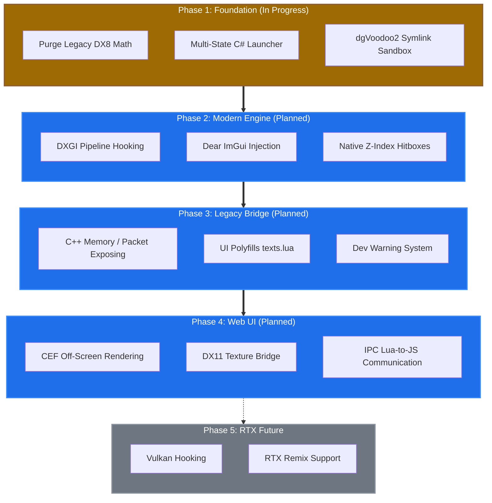

# NextXI (Totally Not Windower5)

I originally yoinked this code from the Official Fenestra Repo and then upgraded a bunch of stuff. I chose to upgrade the launcher to .NET 10 because I wanted to use the latest C# features and also because it was a fun challenge to modernize the codebase. 
I then wanted to understand C++ more and what was done in core. c++ stuff in this project is not taught in school.

I used (Visual Studio 2026 / v145).

> **Note for Developers:** I did rehandle the IPC and the migration to the .NET 10 runtime. I totally used AI tools to /assist <me> in developing.  Notice that word? `/assist`. It's faster than learning at University and when you know how to speak proper English it helps. You should never let it do everything for you! This ain't one of those Vibe coding apps and by no means does it work 100% of the time unless it is simple.  For me it is like having a peer developer.  It's a tool to help already excellent developers do more excellent stuffs.  Get GUD or Get REKT!  I troubleshoot, test, test, test everything. I want the best stuffs and have an app that is bug free. I do not like technical debt either. That stuff gets fixed! 

  

## Roadmap 2026

  

> ⚠️ **Important Notice for Windows 7 and Windows 8.1 Users**
> 
> NextXI is built on **.NET 10** and the **DirectX 11 (dgVoodoo2)** pipeline to push the FFXI ecosystem forward into the modern era. Because of this, NextXI **strictly requires Windows 10 or Windows 11**. The engine will not boot on Windows 7 or 8.1.
>
> It's a tuff pill but I believe in moving the underlying technology of this 2002 game forward rather than being held back by backward compatibility with dead operating systems. If you are playing on a legacy OS or hardware that cannot support modern DirectX 11 abstraction, **Windower 4** remains the definitive home for older setups. You can download it at [https://www.windower.net](https://www.windower.net).

## Build Requirements
To compile this project locally, you will need the following installed:
1. **Visual Studio 2026**
2. **.NET 10 SDK** (Available via the Visual Studio Installer -> .NET Desktop Development)
3. **MSVC v143 Build Tools** (To maintain upstream compatibility with the `core.dll` and `luajit` submodules, ensure the VS 2022 v143 toolset is checked in the VS Installer).
4. **WiX Toolset v3.14** (Required only for building `installer.sln`. Install the core tools from the [WiX Releases Page](https://github.com/wixtoolset/wix3/releases) and the "WiX v3 - Visual Studio 2022" extension).

 

## Deployed File Structure
When installed or successfully compiled, the deployment directory will contain the following critical components:

* `windower.exe` — This is the main executable users launch to start the application.
* `windower.dll` — The core .NET 10 application payload containing all the UI, auto-updater, and game launching logic.
* `windower.runtimeconfig.json` — The configuration file that tells `windower.exe` exactly which .NET 10 framework resources to allocate.
* `core.dll` — The heavy-lifting C++ backend. This library is injected into FFXI to intercept network packets, hook DirectX, and provide the internal Lua environment.
* `paths.xml` — A configuration file required by the C++ core to correctly locate the engine's internal directories.
* `addons/libs/` — Fenestra addon libs and hell yeah I modded things... Maybe Improved? You judge
* `addons/` — All user-created Lua addons (like custom UI elements or chat tools) are installed. Each addon resides in its own folder with a `manifest.xml` file.

 

## License
This software is provided under the MIT License. See the `LICENSE.md` file for details.
